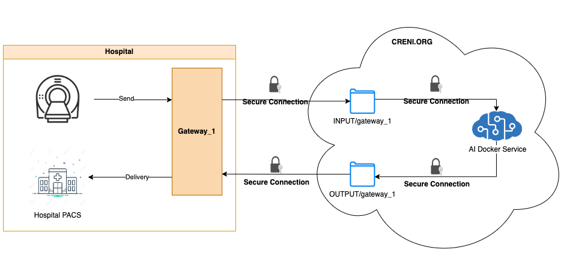
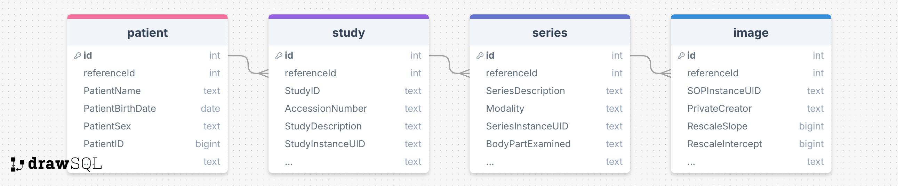

# AI deployment example on CRENI.ORG

## Overview

This repository contains a DICOM AI Service on `creni.org` designed to monitor a specified directory for DICOM files. When a new DICOM file is added to the `INPUT` directory via your gateway(s), the service automatically processes the file, modifying descriptions and adding custom text to the image before saving it to the `OUTPUT` directory. In production deployment, the all DICOM files in `OUTPUT` will `only try one time` to send to your desired PACS destinations configured in creni.org website.

<p align="center">

</p>

## Repository Structure

```
.
├── Dockerfile  # Dockerfile for building the Docker image
├── INPUT   # Directory to monitor for input DICOM files
│   ├── gateway_1  # input files by gateway_{id} where {id} is 1
│   │   ├── 1.2.276.0.7230010.3.1.2.330040832.1.1707350883.230569 # StudyInstanceUID
│   │   │   ├── 1.2.276.0.7230010.3.1.4.330040832.1.1707350883.230571 # SOPInstanceUID
│   │   │   ├── 1.2.276.0.7230010.3.1.4.330040832.1.1707350883.230572
│   │   │   └── 1.2.276.0.7230010.3.1.4.330040832.1.1707350883.230573
│   │   └── image.db # DICOM SQLite database to store tags
│   └── gateway_2  # input files by gateway_{id} where {id} is 2
│       ├── 1.2.276.0.7230010.3.1.2.330040832.1.1707350883.230569 # StudyInstanceUID
│       │   ├── 1.2.276.0.7230010.3.1.4.330040832.1.1707350883.230571  # SOPInstanceUID
│       │   ├── 1.2.276.0.7230010.3.1.4.330040832.1.1707350883.230572
│       │   └── 1.2.276.0.7230010.3.1.4.330040832.1.1707350883.230573
│       └── image.db # DICOM SQLite database to store tags
├── OUTPUT  # Directory where processed files will be saved
│   ├── gateway_1   # output files to gateway_{id} where {id} is 1. Output files must be DICOM format with any names.
│   │   ├── output.230571
│   │   ├── output.230572
│   │   └── output.230573
│   └── gateway_2   # output files to gateway_{id} where {id} is 2. Output files must be DICOM format in subfolders.
│       └── 1.2.276.0.7230010.3.1.2.330040832.1.1707350883.230569
│           ├── 1.2.276.0.7230010.3.1.4.330040832.1.1707350883.230571
│           ├── 1.2.276.0.7230010.3.1.4.330040832.1.1707350883.230572
│           └── 1.2.276.0.7230010.3.1.4.330040832.1.1707350883.230573
├── README.md   # Project documentation
├── development.sh  # Script to run the Docker Compose environment
├── docker-compose-development.yml  # Docker Compose configuration for development
├── main.py  # Main python script for the DICOM Watchdog Service
└── requirements.txt # Python dependencies for the project
```

## image.db

DICOM SQLite database to store DICOM tags. Database schemma follows:

<p align="center">

</p>

## Prerequisites

Ensure you have the following installed on your system:

- [Docker](https://www.docker.com/get-started)
- [Docker Compose](https://docs.docker.com/compose/install/)

## Getting Started

### 1. Clone the repository

```bash
git clone https://github.com/PotatoThanh/creni.org.git
cd creni.org
```

### 2. Understand Mapping INPUT and OUTPUT folder to Docker service

In `docker-compose-development.yml`, Docker service maps:

- `./INPUT:/app/INPUT` maps `./INPUT` at your local machine to `/app/INPUT` inside docker service. We will change `./INPUT` accordingly in our CLOUD.
- `./OUTPUT:/app/OUTPUT` maps `./OUTPUT` at your local machine to `/app/OUTPUT` inside docker service. We will change `./OUTPUT` accordingly in our CLOUD.

### 3. Run the repository

To quickly start the development environment, use the provided development.sh script:

```bash
./development.sh
```

This script will:

- Stop any running Docker Compose services.
- Build and start the containers defined in docker-compose-development.yml.

### 4. Monitor DICOM Files

Each gateway desktop application will be assigned `gateway_{id}` (e.g., gateway_1). `{id}` is unique for each gateway. You can only see your gateways.
Once the environment is up and running:

- In development, place your DICOM files into the `INPUT/gateway_{id}` directory. In production, all DICOM files sent via your gateway(s) will appear in the `INPUT/gateway_{id}` folder.
- In development, the processed DICOM files will be automatically saved in the `OUTPUT/gateway_{id}` directory. In production, all DICOM files from the `OUTPUT/gateway_{id}` folder will transfer to your desired PACS destinations in creni.org website.

### 5. Stopping the Service

To stop the running service, simply press Ctrl+C in the terminal where the service is running or use the following command:

```bash
docker compose -f docker-compose-development.yml down
```

## Customization

### 1. Dockerfile

The `Dockerfile` is used to create a Docker image with Python 3.9 and all the necessary dependencies installed, including opencv for image processing.

### 2. docker-compose-development.yml

This file defines the services needed for the development environment. You can modify the volume mappings, environment variables, or other configurations as needed.

### 3. main.py

The `main.py` script is the core of the DICOM Docker Service. It monitors the `INPUT/gateway_{id}` directory for new DICOM files, processes them, and saves the output in the `OUTPUT/gateway_{id}` directory. You can customize the processing logic by modifying the `process_dicom`, `modify_descriptions`, and `add_text_to_image` functions as well as your AI interence model.

### 4. requirements.txt

If you need to install additional Python dependencies, add them to `requirements.txt` and rebuild the Docker image.

## Contributing

Contributions are welcome! Please submit a pull request or open an issue if you have suggestions or find a bug.
